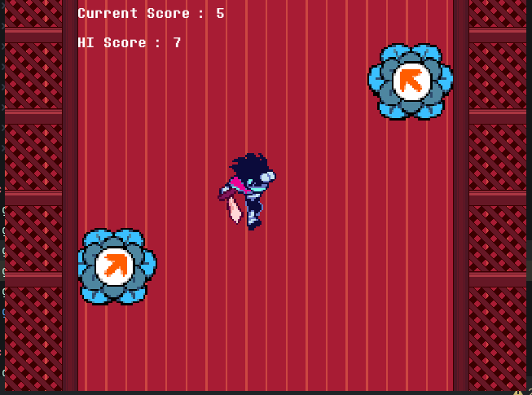
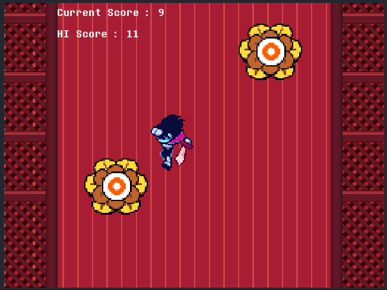

# Deltarune Platformer (WIP)
## A deltarune-inspired platformer game by [Hazoro](https://github.com/hazorox)
Live at [Itch.io](https://hazoro.itch.io/deltarune-tower)

Liked the new platformer mechanics in Deltarune Chapter 5 ?

Well, I also did, so recreated it in my own game :D

# Controls
- Jump : Space, X, K
- Slash : J, C
- Movement : WASD or Arrows
- Escape to Exit

# Tower Mode
An Infinite tower with different difficulties

# AI-Declaration
- Calculating Vector logic for the hit-target flowers
- Help with my first time managing chunks